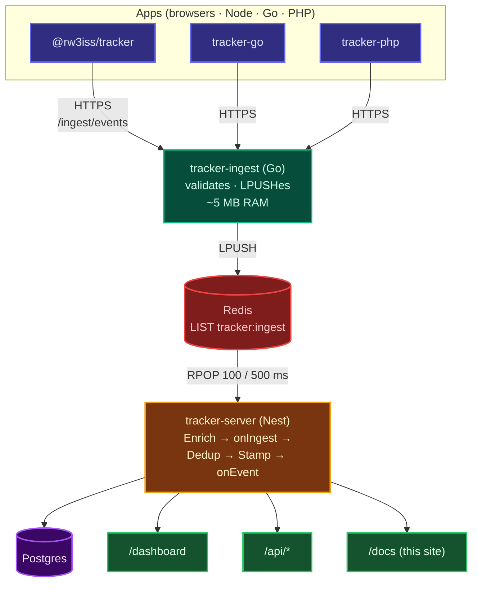
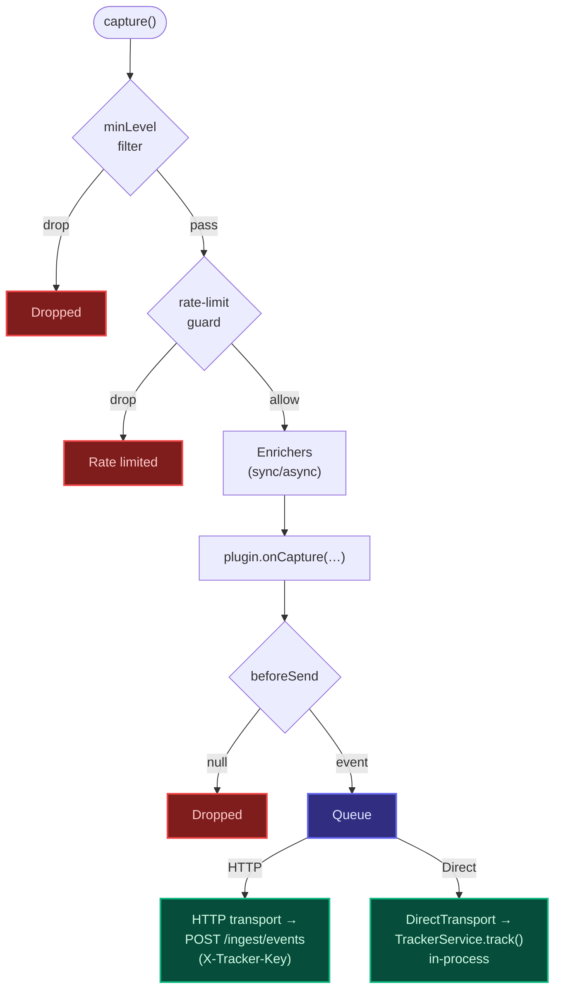
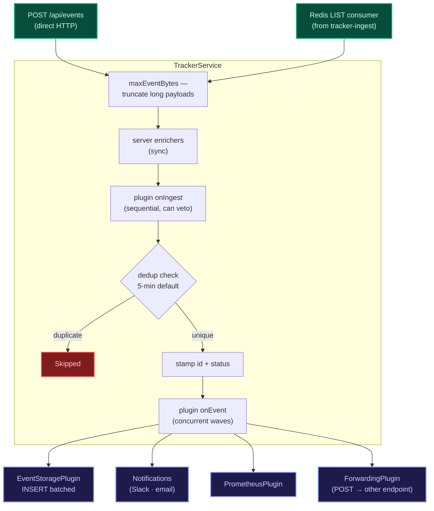
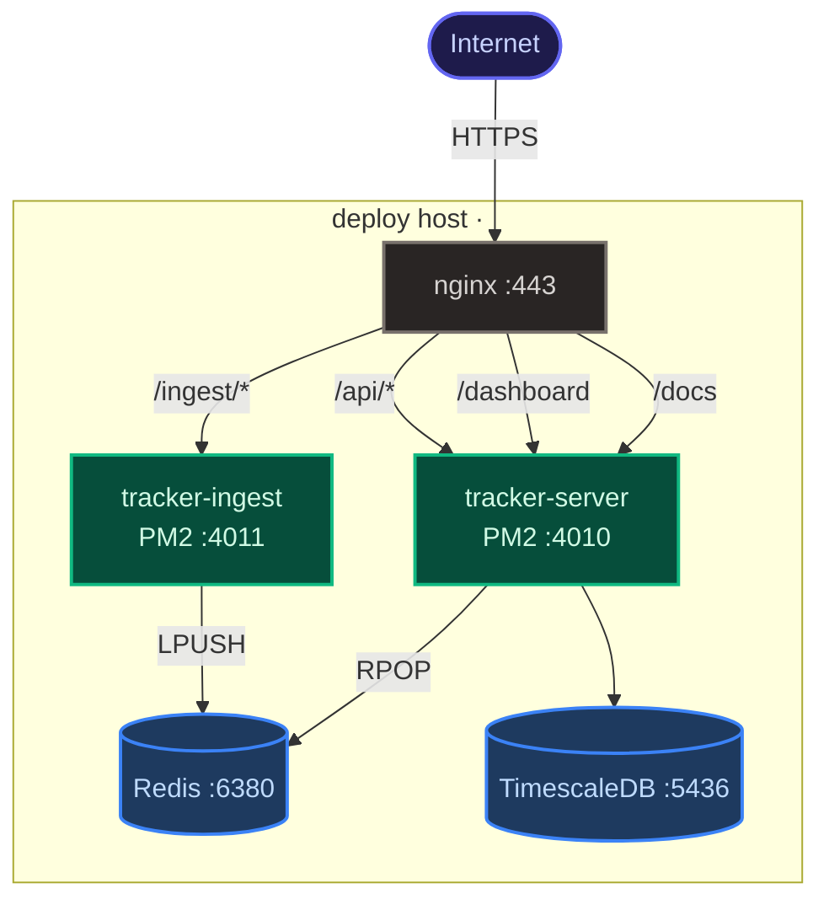

The tracker platform is five small services that hand events from end-user
apps through to a queryable Postgres store, with a self-hosted dashboard on
top. Each piece has one job and one wire format between it and the next.

## System overview

## Event lifecycle

A single event passes through six steps. Steps 1–2 happen client-side; 3–6
happen server-side and are observable in the dashboard.

1. **Capture** — `tracker.error(...)` / `.info(...)` / etc. Runs the local
   pipeline (severity filter → rate limit → enrichers → plugin
   `onCapture` → `beforeSend` → queue).
2. **Batch flush** — the in-memory queue ships every 5 seconds (or when
   batch size hits the cap). One HTTP `POST /ingest/events` per flush.
3. **Ingest** — `tracker-ingest` validates the API key, parses JSON,
   `LPUSH`es to Redis. No storage, no enrichment — the goal is to absorb
   bursts without a Node runtime in the hot path.
4. **Drain** — `tracker-server`'s `RedisIngestConsumer` plugin runs `RPOP`
   in batches of 100 every 500 ms.
5. **Pipeline** — server-side enrichers → plugin `onIngest` (can veto) →
   dedup check (5-min window by default) → stamp (id, status, receivedAt)
   → plugin `onEvent` (concurrent waves).
6. **Storage** — `EventStoragePlugin` batch-INSERTs into Postgres
   (TimescaleDB hypertable in production).

The dashboard polls `tracker_events` directly via the consumer's
[query API](/docs/api/query/), and the [SSE stream](/docs/api/query/#sse) pushes
new events to open dashboards within ~2 seconds of insertion.

## Client-side capture pipeline

`DirectTransport` is used by NestJS apps that want to track their own
errors into their own `TrackerModule` — no localhost HTTP loop. See the
[TypeScript SDK guide](/docs/sdk/typescript/#in-process-self-tracking).

## Server-side processing

Plugins are how every behaviour above is wired in — storage, dedup,
notifications, Prometheus, even the Redis consumer itself. The library
ships with the common ones; consumers add their own by passing them into
`TrackerModule.register({ plugins: […] })`.

## Database

**Production** — TimescaleDB hypertable on `receivedAt`, 1-day chunks,
auto-compression after 7 days, segmented by `(appId, type)`.

**Schema:**

| Column       | Type        | Notes                               |
|--------------|-------------|-------------------------------------|
| `id`         | uuid        | server-assigned, primary key         |
| `type`       | varchar     | `error \| warning \| info \| debug \| event` |
| `message`    | text        | event description                    |
| `appId`      | varchar     | source application (indexed)         |
| `category`   | varchar     | optional grouping (e.g. `db:query-failed`) |
| `status`     | varchar     | lifecycle: `new \| viewed \| resolved \| …` |
| `payload`    | jsonb       | arbitrary structured data            |
| `error`      | jsonb       | `{ name, message, stack }`           |
| `context`    | jsonb       | userId, sessionId, environment, etc. |
| `tags`       | text        | comma-separated                      |
| `timestamp`  | bigint      | client capture time (Unix ms)        |
| `receivedAt` | bigint      | server ingest time (Unix ms, partition key) |

**Indexes** (production): B-tree on `type`, `appId`, `category`, `status`,
`receivedAt DESC`; composite `(appId, type, receivedAt DESC)` for the
primary dashboard query path; GIN `jsonb_path_ops` on `payload` and
`context` so `WHERE payload @> '{"orderId":"123"}'::jsonb` hits an index;
expression indexes on `context->>'userId'`, `context->>'environment'`,
`context->>'sessionId'`.

For development the InMemory adapter or a vanilla Postgres install both
work; only the production deployment turns on the TimescaleDB features.

## Deployment

The production deployment runs on a single EC2 host (the deploy host,
`<deploy-host-ip>`). Three processes (Go ingest, Node consumer, dashboard
served from the consumer), three stateful containers (TimescaleDB, Redis,
plus an unrelated Postgres for another service), nginx in front for SSL
and routing.

See [Operations → Deploy](/docs/operations/deploy/) for the full deploy
workflow, and [Operations → Configuration](/docs/operations/config/) for every
env var the consumer reads.
