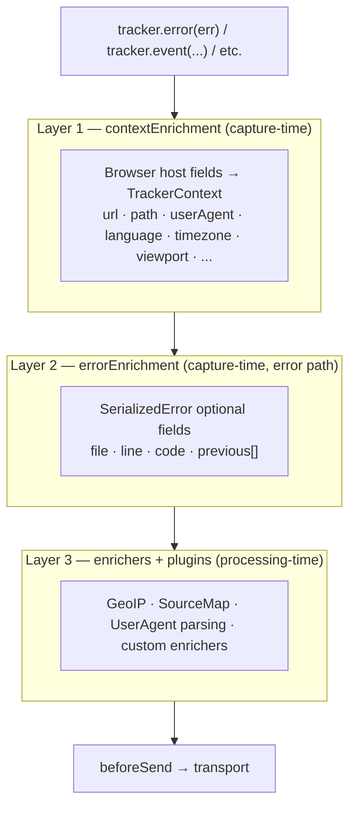

The tracker enriches events at three distinct layers. They look like the
same thing but they're not — different pipelines, different defaults,
different cross-SDK constraints. Knowing which one your use case
belongs to keeps configuration predictable.

## The three layers



| Layer | When it runs | Where it lives | Cross-SDK? |
|---|---|---|---|
| `contextEnrichment` | Every event, capture-time | Emitter (browser-only fields) | TS only — Go and PHP have no equivalent globals |
| `errorEnrichment` | Only `tracker.error()` calls | Emitter (all SDKs) | Yes — TS, Go, and PHP share the wire shape |
| `enrichers` + plugins | Capture-time (emitter plugins) and processing-time (consumer plugins) | Both halves of `@rw3iss/tracker` | Plugin system is TS only; the wire-format additions any plugin produces flow through |

## Layer 1 — `contextEnrichment`

Stamps host-environment fields onto `TrackerContext`. Cheap; runs on
every event. Browser-only (in Node it's a no-op — the source globals
don't exist).

```ts
TrackerClient.init({
  endpoint: '...',
  contextEnrichment: true,                 // standard set (default)
  // contextEnrichment: false,              // off
  // contextEnrichment: 'full',             // every field
  // contextEnrichment: 'minimal',          // url + path only
  // contextEnrichment: { userAgent: false } // standard minus userAgent
  // contextEnrichment: { referrer: true }   // standard plus referrer
});
```

| Field | `true` (standard) | `'full'` | `'minimal'` |
|---|:-:|:-:|:-:|
| url | ✓ | ✓ | ✓ |
| path | ✓ | ✓ | ✓ |
| userAgent | ✓ | ✓ | |
| language | ✓ | ✓ | |
| timezone | ✓ | ✓ | |
| viewport | ✓ | ✓ | |
| referrer | | ✓ | |
| screen | | ✓ | |
| connection | | ✓ | |

Object form layers per-field overrides on top of the **standard set**,
not on top of "everything". Opt into non-standard fields explicitly
(`{ referrer: true }`).

Auto-enriched values run *before* user-provided enrichers and
`setContext()`, so either can override them.

## Layer 2 — `errorEnrichment`

Controls the optional fields on `SerializedError`. `name`, `message`,
`stack` are always emitted — only the four payload-size-sensitive
fields are configurable.

```ts
errorEnrichment: true,                   // 'full' (default) — every optional field
// errorEnrichment: false,                // 'minimal' — name/message/stack only
// errorEnrichment: 'full',
// errorEnrichment: 'minimal',
// errorEnrichment: { previous: false }   // full minus the cause chain
```

| Field | `true` / `'full'` | `false` / `'minimal'` |
|---|:-:|:-:|
| name | ✓ | ✓ |
| message | ✓ | ✓ |
| stack | ✓ | ✓ |
| file | ✓ | |
| line | ✓ | |
| code | ✓ | |
| previous[] | ✓ | |

Identical grammar in Go and PHP — see the per-language SDK pages for
the exact constructor / config-key syntax. The **wire shape is shared**
across all three SDKs; see [API contract](/docs/api/contract/).

Primarily a **payload-size knob** — at high volume the per-frame fields
and a 5-deep `previous` chain add real bytes on the wire. CPU savings
are modest (TS: a stack regex parse and the cause walk; Go and PHP:
essentially nil because the underlying property reads / runtime stack
calls dominate cost regardless).

## Layer 3 — enrichers and plugins

Use this for anything richer than per-field flags: custom data,
asynchronous lookups, plugin-provided enrichment.

```ts
TrackerClient.init({
  endpoint: '...',
  enrichers: [
    (event) => ({ ...event, payload: { ...event.payload, build: GIT_SHA } }),
  ],
  plugins: [new BreadcrumbsPlugin()],
});
```

Heavy server-side enrichment — GeoIP from request IP, source-map
resolution, UserAgent parsing — lives in `@rw3iss/tracker/consumer`
plugins, not in this layer. Keep capture-time cheap.

## Decision guide

| You want to... | Use |
|---|---|
| Add `userId` / `accountId` to every event | `tracker.setContext({...})` |
| Drop `userAgent` from every event for privacy | `contextEnrichment: { userAgent: false }` |
| Capture only `url` + `path` (privacy-sensitive embed) | `contextEnrichment: 'minimal'` |
| Drop the wrapped-cause chain to shrink errors | `errorEnrichment: { previous: false }` |
| Strip everything optional from errors | `errorEnrichment: false` |
| Stamp build SHA on every event | `enrichers: [(e) => ({ ...e, payload: {...e.payload, sha} })]` |
| Resolve GeoIP from the source IP | server-side `GeoIpEnricher` plugin (consumer) |
| Re-source-map errors before storage | server-side `SourceMapEnricher` plugin (consumer) |
