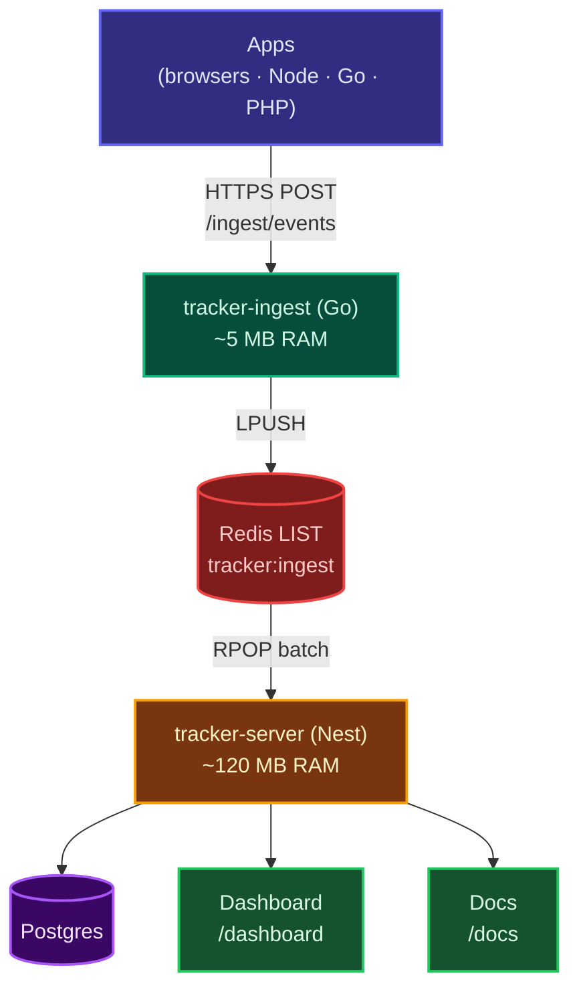

import { Card, CardGrid } from '@astrojs/starlight/components';

## What is the tracker

A self-hosted event + error tracking platform. Every rw3iss service emits
events through a tiny SDK; events are validated by a Go ingestion server,
queued in Redis, drained into Postgres by `tracker-server`, and visible in
real time via the dashboard at `tracker.ryanweiss.net/dashboard`.

It replaces Sentry for our error capture, and doubles as a domain-event log
for any signal we want to inspect later (auction state, payment outcomes,
etc.). Everything runs on our own infrastructure — no third-party SaaS, no
event-volume surprises on the bill.

<CardGrid>
  <Card title="Just send an event" icon="rocket">
    Three lines of TypeScript / Go / PHP — see [Quick start](/docs/quick-start/).
  </Card>
  <Card title="Wire format" icon="document">
    Stable HTTP contract — see the [API contract](/docs/api/contract/).
  </Card>
  <Card title="Architecture" icon="puzzle">
    How the emitter / ingest / consumer pieces fit — see [Architecture](/docs/concepts/architecture/).
  </Card>
  <Card title="Operations" icon="setting">
    Configure tracker-server, the dashboard, this docs site — see [Operations](/docs/operations/config/).
  </Card>
</CardGrid>

## At a glance

## Repos

| Repo                            | Role                                                        |
|---------------------------------|-------------------------------------------------------------|
| [tracker](https://github.com/rw3iss/tracker)         | TS library — emitter + NestJS consumer engine + dashboard |
| [tracker-server](https://github.com/rw3iss/tracker-server) | NestJS deployment — runs the consumer, dashboard, this docs site |
| [tracker-ingest](https://github.com/rw3iss/tracker-ingest) | Go HTTP ingest — minimal, absorbs bursts, LPUSH to Redis |
| [tracker-go](https://github.com/rw3iss/tracker-go)         | Go emitter — stdlib-only, mirrors the TS surface |
| [tracker-php](https://github.com/rw3iss/tracker-php)       | PHP emitter (Composer)                          |
